## Introduction
The ScnMsg email client is a simple email client created using Python and some HTML with an aim to detect, reduce, and hopefully prevent malware execution, scams, and phishing attempts on the technology illiterate, cyber-unaware, and especially the elderly population that can be easily manipulated. The goal is to integrate features that will check emails against existing tools, such as Virus Total, and use AI to assess contents to provide a scoring mechanism to alert a user to potential risks through use of Groq API calls. Complex features seen in other email clients such as automatic replies, folder sorting, and advanced filtering rules will intentionally be left out since the target users for this software would likely not be the group to leverage those features and may make its use more complicated for the anticipated user.

## Explanation and Details
This is a high level summary covering the order of operations for the application. Please see the **Screenshots and Code Explanation** for a lower level description of functionality:
1. Download emails from the email provider IMAP server
2. Scan email contents and attached files
3. Generate a report based on the returned scan and analysis results
4. Launch and open the GUI
5. User interacts with the application, can view and reply to emails, and open email reports in the browser

### Use of AI in project
The ScnMsg icon was created using ChatGPT, with the prompt:
> Can you make an icon for an application I'm building called ScnMsg?
> 
> This proposal is to make a simple email client using Python to detect, reduce, and hopefully prevent malware execution, scams, and phishing attempts on the technology illiterate, cyber-unaware, and especially the elderly population that can be easily manipulated. The goal is to integrate features that will check emails against existing tools and use AI to assess contents to provide a scoring mechanism to alert a user to potential risks.

AI was also used to create phishing email that was sent to see if Llama would indicate the message as likely a phishing attempt, as well as some other files that were sent from another test email to see if messages that were inteded as cybersecurity notices would be falsely marked as SPAM.

Finally, AI is being actively used within the code using Groq API calls in order to categorize the emails as Normal, Spam, Phishing, etc. based on the contents of the email body.

## Setup and Libraries
1. Install Python on your system: 
Windows: Navigate to https://www.python.org/downloads/ and install the latest version of Python 3 using your GUI 
Linux: `sudo apt install python3`

2. The following are not standard Python3 libraries and must be installed manually before use:
- bs4 (BeautifulSoup)
- imap_tools
- jinja2
- PyQt5
- requests
- vt (Virus Total)  
Use this command to install these packages before attempting to run the code: 
`pip install beautifulsoup4 imap-tools Jinja2 PyQt5 requests virustotal-python` 
*Note: May need to add pip to your systems PATH (environment variables).*

3. To run the application GUI, run either of these commands from the root folder (ScnMsg) of the code: 
Windows:  `python .\Python\email_client.py` 
Linux: `python3 .\Python\email_client.py` 
*Notes:  Command syntax may vary by OS or other settings. MacOS has not been tested for this project.*

### Table of Libraries Used
| Module or Package | Component(s) | Usage |
| ------- | ---------- | -------- |
| [bs4](https://pypi.org/project/beautifulsoup4/) | BeautifulSoup | Used to convert an HTML only email to text due to Groq API token restrictions. |
| [configparser](https://docs.python.org/3/library/configparser.html#module-configparser) | - | Use of Config file for storing email settings |
| [hashlib](https://docs.python.org/3/library/hashlib.html#module-hashlib) | - | Hashing of files for faster VirusTotal lookup |
| [imap_tools](https://pypi.org/project/imap-tools/) | MailBox | Recieve emails from an email provider using IMAP server |
| [io](https://docs.python.org/3/library/io.html#module-io) | BytesIO | Convert attachments to bytes for VirusTotal scanning of files |
| [jinja2](https://pypi.org/project/Jinja2/) | - | Template engine that builds HTML report files with passed variables |
| [json](https://docs.python.org/3/library/json.html#module-json) | - | Read returned Gorq data as JSON format |
| [operator](https://docs.python.org/3/library/operator.html#module-operator) | itemgetter | Sort emails from newest to oldest, or vice versa |
| [os](https://docs.python.org/3/library/os.html#module-os) | - | USE CASE |
| [pickle](https://docs.python.org/3/library/pickle.html#module-pickle) | - | Save each email in its own pickle file to avoid filling RAM |
| [PyQt5](https://pypi.org/project/PyQt5/) | QtGui QtWidgets | Email Client GUI |
| [requests](https://pypi.org/project/requests/) | - | Integration with Groq API via URL POST request |
| [sys](https://docs.python.org/3/library/sys.html#module-sys) | - | Start and Exit the Application GUI |
| [time](https://docs.python.org/3/library/time.html#module-time) | - | Pause between VirusTotal API calls when using Public API key |
| [vt](https://github.com/doomedraven/VirusTotalApi) | - | Integration with VirusTotal API |
| [webbrowser](https://docs.python.org/3/library/webbrowser.html#module-webbrowser) | - | Open the email reports in a webbrowser |

## Screenshots and Code Explanation
This section displays tables containing screenshots of key secitons of code code with descriptions of the functionality being performed for each package (file) of the program.

### Python Code that Creates and Loads the Applicaiton GUI (./Python/email_client.py)
This Python module is reponsible for creating, loading, and running the application in a GUI.
| Code Image *(click to enlarge)* | Description |
|-------------------------------|-------------|
| 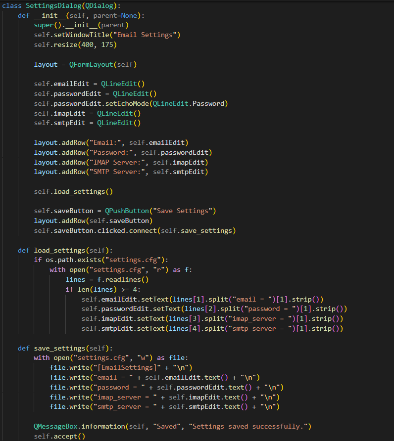&nbsp;&nbsp;&nbsp;&nbsp;&nbsp;&nbsp;&nbsp;&nbsp;&nbsp;&nbsp;&nbsp;&nbsp;&nbsp;&nbsp;&nbsp;&nbsp;&nbsp;&nbsp;&nbsp;&nbsp; | The `SettingsDialog` class is responsible for a popup window that allows a user to configure the email account settings: email, password, IMAP and SMPT servers. |
| &nbsp;&nbsp;&nbsp;&nbsp;&nbsp;&nbsp;&nbsp;&nbsp;&nbsp;&nbsp;&nbsp;&nbsp;&nbsp;&nbsp;&nbsp;&nbsp;&nbsp;&nbsp;&nbsp;&nbsp; | The `EmailClient` class first initializes the GUI for for the application. |
| 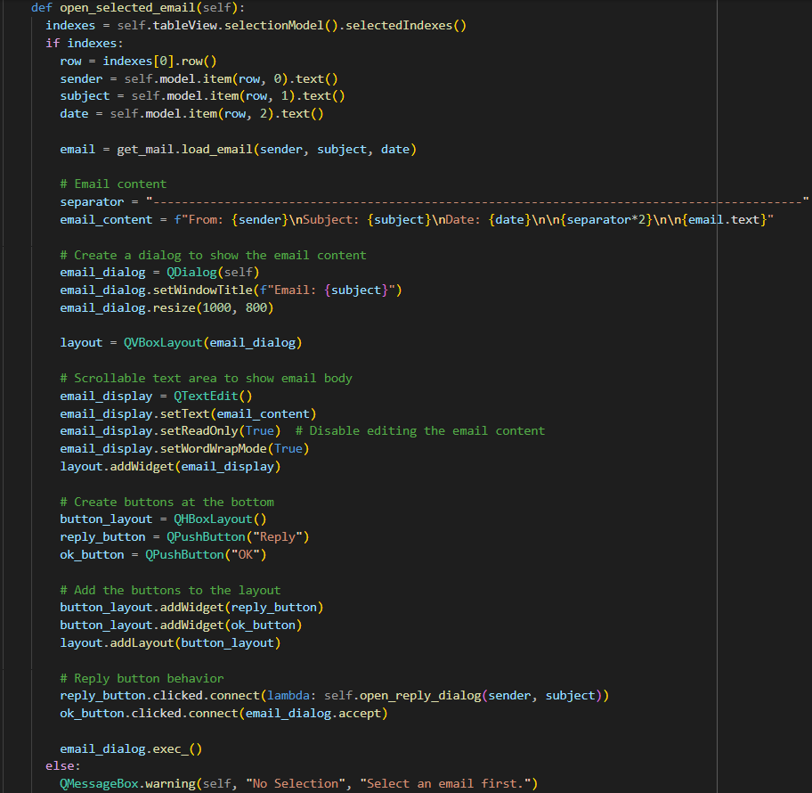&nbsp;&nbsp;&nbsp;&nbsp;&nbsp;&nbsp;&nbsp;&nbsp;&nbsp;&nbsp;&nbsp;&nbsp;&nbsp;&nbsp;&nbsp;&nbsp;&nbsp;&nbsp;&nbsp;&nbsp; | The `open_selected_email` function opens the email for the selected row in the GUI. |
| 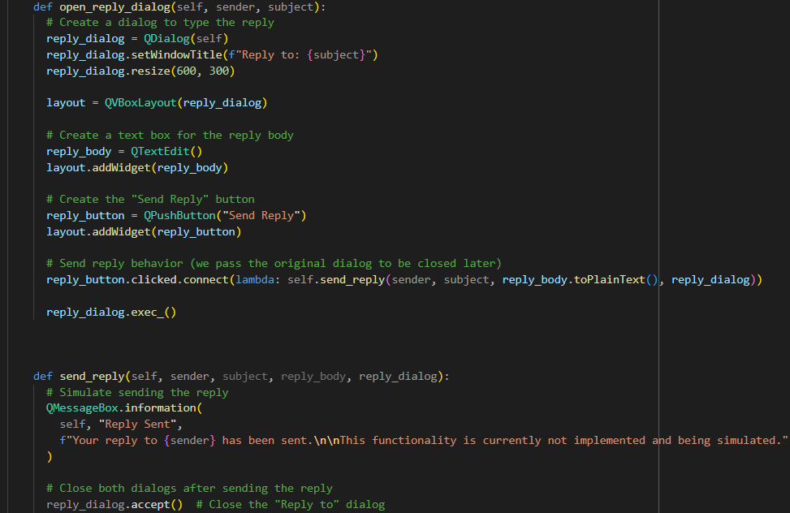&nbsp;&nbsp;&nbsp;&nbsp;&nbsp;&nbsp;&nbsp;&nbsp;&nbsp;&nbsp;&nbsp;&nbsp;&nbsp;&nbsp;&nbsp;&nbsp;&nbsp;&nbsp;&nbsp;&nbsp; | The `open_reply_dialog` function creates a popup that allows the user to reply back to an email. This `send_reply` function button is currently simulated until SMTP functionality is integrated into this application. |
| &nbsp;&nbsp;&nbsp;&nbsp;&nbsp;&nbsp;&nbsp;&nbsp;&nbsp;&nbsp;&nbsp;&nbsp;&nbsp;&nbsp;&nbsp;&nbsp;&nbsp;&nbsp;&nbsp;&nbsp; | The `download_and_update_emails` function first loads the email settings, then downloads, saves, and creates a list of the emails by calling the `get_mail` module, and finally populates the table in the GUI with the emails that can be opened. This `send_reply` function button is currently simulated until SMTP functionality is integrated into this application. The `load_email_settings` function is currently redundant, and functionality needs to be fully merged into the `get_mail` module. |
| &nbsp;&nbsp;&nbsp;&nbsp;&nbsp;&nbsp;&nbsp;&nbsp;&nbsp;&nbsp;&nbsp;&nbsp;&nbsp;&nbsp;&nbsp;&nbsp;&nbsp;&nbsp;&nbsp;&nbsp; | The `open_email_report` function opens the report in the default web browser for the associated email in the selected row of the emails table. |

### Python Code that Gets Email from the IMAP Server (./Python/get_mail.py)
This Python module is reponsible for downloading emails from the IMAP server set in the settings menu, saving each email to a pickle file, and creating a list of dictionaries that represent summary data for all emails. It has an additional function that can be called by other modules to load a single pickle file and return the needed contents from the object.
| Code Image *(click to enlarge)* | Description |
|-------------------------------|-------------|
| 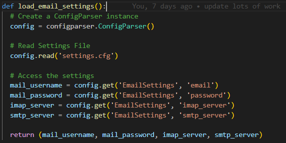&nbsp;&nbsp;&nbsp;&nbsp;&nbsp;&nbsp;&nbsp;&nbsp;&nbsp;&nbsp;&nbsp;&nbsp;&nbsp;&nbsp;&nbsp;&nbsp;&nbsp;&nbsp;&nbsp;&nbsp; | This section of code loads the email account and provider settings that are stored in a configuration file. While this data is not ecrypted, it is a better solution than hard coding the values into the code itself as it is ommitted from the GitHub repository through use of a GitIgnore file. A later improvement would be to implement encryption of this data. |
| 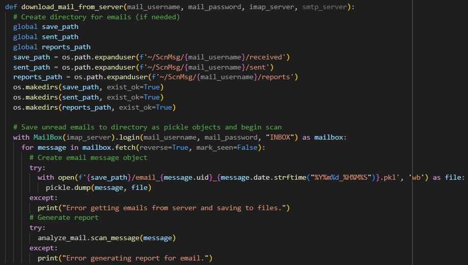&nbsp;&nbsp;&nbsp;&nbsp;&nbsp;&nbsp;&nbsp;&nbsp;&nbsp;&nbsp;&nbsp;&nbsp;&nbsp;&nbsp;&nbsp;&nbsp;&nbsp;&nbsp;&nbsp;&nbsp; | The code here downloads all the emails from the IMAP server and saves them individually to pickle files. This was the solution to preemtively avoid filling the RAM trying to load potentially hundreds or thousands of emails from an operation email account as opposed to the dozens in the test email account created for this project. An improvement that could be made here is to only downlaod new emails, but this was intentionally left out at this stage due to the need to itteratively test code changes using the same set of emails. |
| 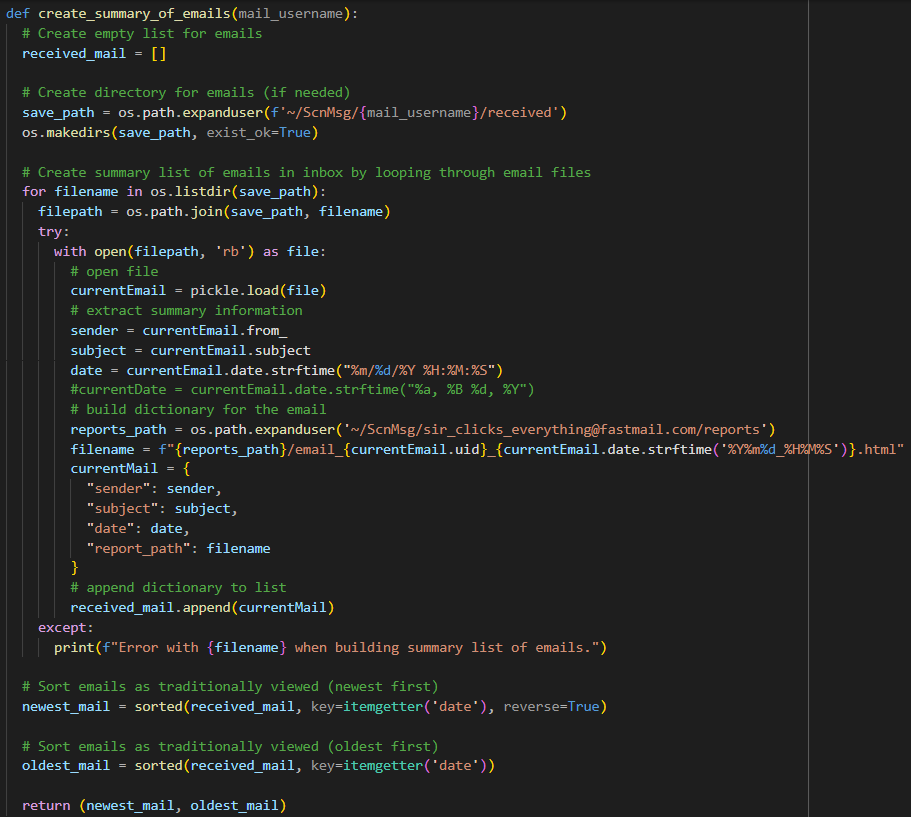&nbsp;&nbsp;&nbsp;&nbsp;&nbsp;&nbsp;&nbsp;&nbsp;&nbsp;&nbsp;&nbsp;&nbsp;&nbsp;&nbsp;&nbsp;&nbsp;&nbsp;&nbsp;&nbsp;&nbsp; | The code here creates a list of dictionaries representing all the emails stored in pickle files. This was the solution to more rapidly fill the data for the table of emails when the GUI first loads versus loading each pickle file individually to populate the data, though more testing may need to be conducted with a larger email acount to see: 1. if this method is actually more efficient, and 2. if the list has the potential to become too large and exhaust memory, especially in smaller systems. |
| 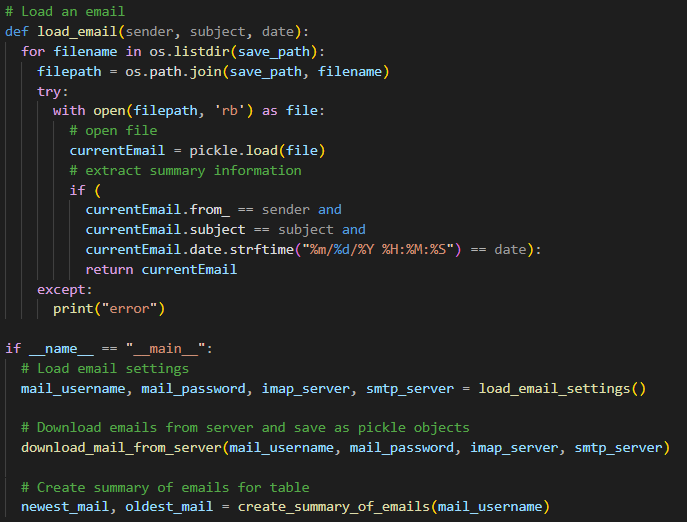&nbsp;&nbsp;&nbsp;&nbsp;&nbsp;&nbsp;&nbsp;&nbsp;&nbsp;&nbsp;&nbsp;&nbsp;&nbsp;&nbsp;&nbsp;&nbsp;&nbsp;&nbsp;&nbsp;&nbsp; | This function is callable by other functions, including used in other modules, to load an individual pickle file of the email object and return the needed data from the object, including everything from the sender, date, and subject, to the contents and even the payload, or the actual files, attached to the message. |

### Python Code that Scans Each Email (./Python/analyze_mail.py)
This Python module is reponsible for analyzing the email contents and attachments to create the data for the email scan report.
| Code Image *(click to enlarge)* | Description |
|-------------------------------|-------------|
| 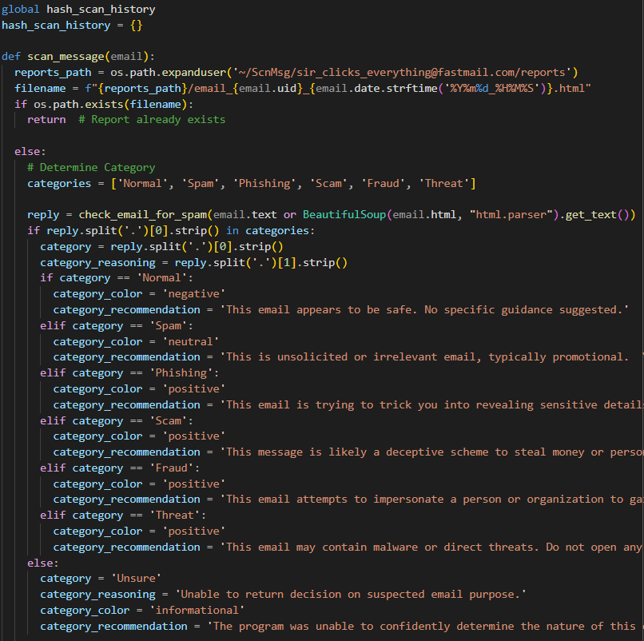&nbsp;&nbsp;&nbsp;&nbsp;&nbsp;&nbsp;&nbsp;&nbsp;&nbsp;&nbsp;&nbsp;&nbsp;&nbsp;&nbsp;&nbsp;&nbsp;&nbsp;&nbsp;&nbsp;&nbsp; | This section of the code begins by creating an empty dictionary of file hashes that have already been scanned. Some of the emails have common attachments such as encryption keys attached to Proton mail emails, or image attachments that are part of signature blocks. This hash scan history dictionary was the solution to speed up scan time by only passing new hashes and files to VirusTotal. The `scan_message` function calls the `check_email_for_spam` function that makes a Groq API call to analyze the contents of the email and assign a category. The `scan_message` function then assigns a category color and recommendation based on the category assigned. |
| 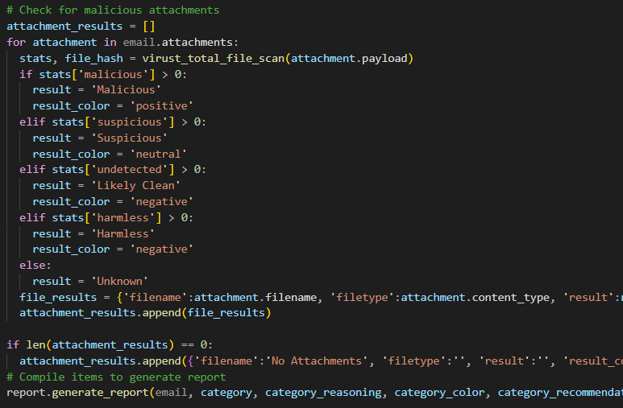&nbsp;&nbsp;&nbsp;&nbsp;&nbsp;&nbsp;&nbsp;&nbsp;&nbsp;&nbsp;&nbsp;&nbsp;&nbsp;&nbsp;&nbsp;&nbsp;&nbsp;&nbsp;&nbsp;&nbsp; | This section of the code is a continuation of the `scan_message` function. This portion calls the `virus_total_file_scan` function that sends the attachments payload to the VirusTotal API to be scanned for malware. When the results are returned, the code then assigns a result name and color to the attachment. |
| 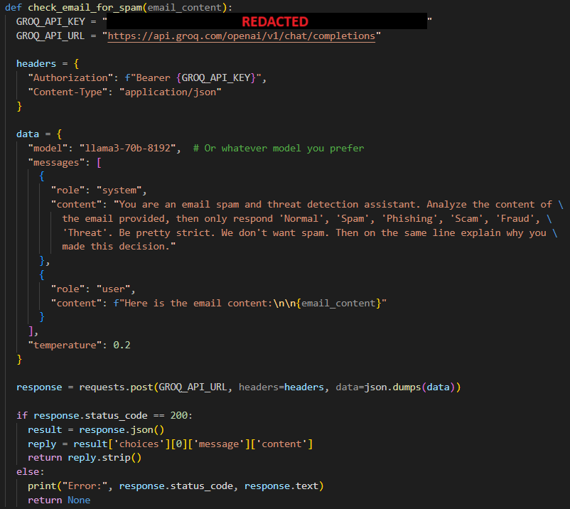&nbsp;&nbsp;&nbsp;&nbsp;&nbsp;&nbsp;&nbsp;&nbsp;&nbsp;&nbsp;&nbsp;&nbsp;&nbsp;&nbsp;&nbsp;&nbsp;&nbsp;&nbsp;&nbsp;&nbsp; | This portion of the code is the `check_email_for_spam` function. The function makes a Groq API call to use Llama 3 70B to analyze the contents of the email and assign a category. The Groq API key is currently hard coded and should be removed to a configuration file for better security. |
| 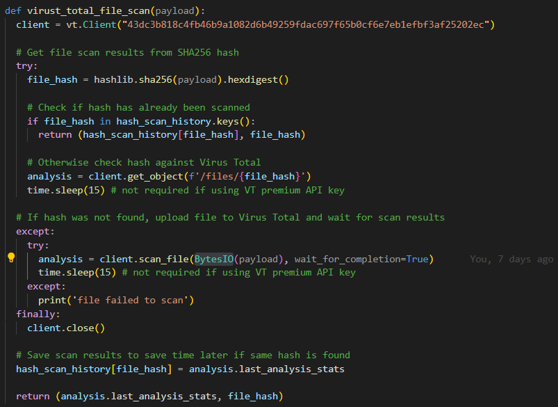&nbsp;&nbsp;&nbsp;&nbsp;&nbsp;&nbsp;&nbsp;&nbsp;&nbsp;&nbsp;&nbsp;&nbsp;&nbsp;&nbsp;&nbsp;&nbsp;&nbsp;&nbsp;&nbsp;&nbsp; | This section of the code is the `virus_total_file_scan` function. The function firsts attempts to querry scan results based on the file hash alone which is faster, and if the hash does not exist in VirusTotal's database then the code sends the full file to be scanned for malware. |

### Python Code that Generates HTML Report (./Python/report.py)
This Python module is reponsible for creating the reports for each email by filling in an HTML template form.
| Code Image *(click to enlarge)* | Description |
|-------------------------------|-------------|
| 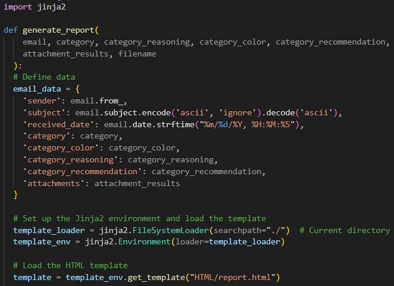&nbsp;&nbsp;&nbsp;&nbsp;&nbsp;&nbsp;&nbsp;&nbsp;&nbsp;&nbsp;&nbsp;&nbsp;&nbsp;&nbsp;&nbsp;&nbsp;&nbsp;&nbsp;&nbsp;&nbsp; | The top portion of the code takes the parameters passed to the module, creates a dictionary of this data to be used later, and then loads the template using the Jinja2 library. Some data transformation occurs here, such as removing non-ASCII characters from the subject that ocassionaly cause issues generating the HTML report and formatting of the date and time the email was received. |
| 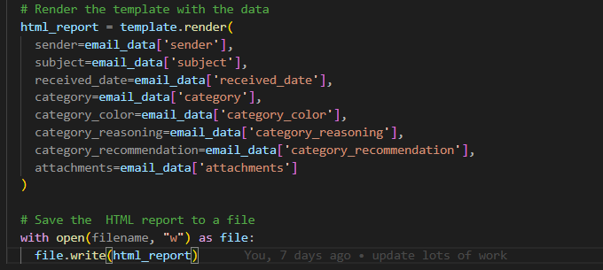&nbsp;&nbsp;&nbsp;&nbsp;&nbsp;&nbsp;&nbsp;&nbsp;&nbsp;&nbsp;&nbsp;&nbsp;&nbsp;&nbsp;&nbsp;&nbsp;&nbsp;&nbsp;&nbsp;&nbsp; | The module then fills in the placeholders in the template from the data dictionary created earlier, ending in saving the file to a local directory to be called later by the code when trying to view the report. The parameters could have been called direactly here, but with data transformation that is occuring, it made the code simpler to follow by performing these functions earlier in the code when creating the dictionary. |

### HTML Report Template (./HTML/report.html)
This HTML template is the foundation for every email scan report
| Code Image *(click to enlarge)* | Description |
|-------------------------------|-------------|
| &nbsp;&nbsp;&nbsp;&nbsp;&nbsp;&nbsp;&nbsp;&nbsp;&nbsp;&nbsp;&nbsp;&nbsp;&nbsp;&nbsp;&nbsp;&nbsp;&nbsp;&nbsp;&nbsp;&nbsp; | Some of the class attributes are formatting blocks that define coloring for severity levels: `.negative` (no flagged alerts), `.neutral` (potentially noteworthy but not malicious), `.positive` (likely malicious), `.informational` (general awareness), and `.unknown` (ex. couldn't be processed due to error or failure). The severity levels are passed to placeholders as variables when creating the report allowing the blocks colors to be defined based on the analysis results.     the class attribures are applied dynamically within the code to allow different coloring based on the results of the analysis, such as a file returned by Virus Total as likely being malware showing as red, or a potential spam email showing as yellow (not likely malicious, but might want to be ignored). |
| &nbsp;&nbsp;&nbsp;&nbsp;&nbsp;&nbsp;&nbsp;&nbsp;&nbsp;&nbsp;&nbsp;&nbsp;&nbsp;&nbsp;&nbsp;&nbsp;&nbsp;&nbsp;&nbsp;&nbsp; | This section of the HTML report template defines the structure for the top of the email analysis report. It displays the header of the report, email details such as sender, subject, and the received date, and the AI-generated analysis for the email body contents. Template placeholders can be seen here where the Jinja2 engine is creating the report by filling in variable placeholders such as {{ sender }} or {{ category_reasoning }} |
| &nbsp;&nbsp;&nbsp;&nbsp;&nbsp;&nbsp;&nbsp;&nbsp;&nbsp;&nbsp;&nbsp;&nbsp;&nbsp;&nbsp;&nbsp;&nbsp;&nbsp;&nbsp;&nbsp;&nbsp; | A '{ % for % } statement is used to generate separate sections for each file attachment in the email. For example, an email with one attachment will have only one block, while an email with six attachments will have six blocks, each with their cooresponding information from the analysis by Virus Total. An '{ % if % }' statement is used to dynamically generate a link to the associated Virus Total page for the file that was analyzed, or if there are no attachments an information block is created using anto let the report reader know nothing was attached. |
| &nbsp;&nbsp;&nbsp;&nbsp;&nbsp;&nbsp;&nbsp;&nbsp;&nbsp;&nbsp;&nbsp;&nbsp;&nbsp;&nbsp;&nbsp;&nbsp;&nbsp;&nbsp;&nbsp;&nbsp; | The footer of the report contains copyright and license details. There is also a script that contains code generating a date for the time the report was created to be used in the header. Both of these detail not only create a professional looking report, but provide important information to the reader. |

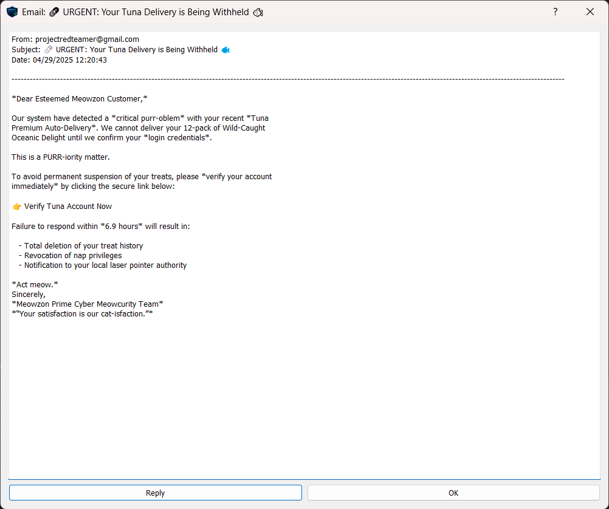

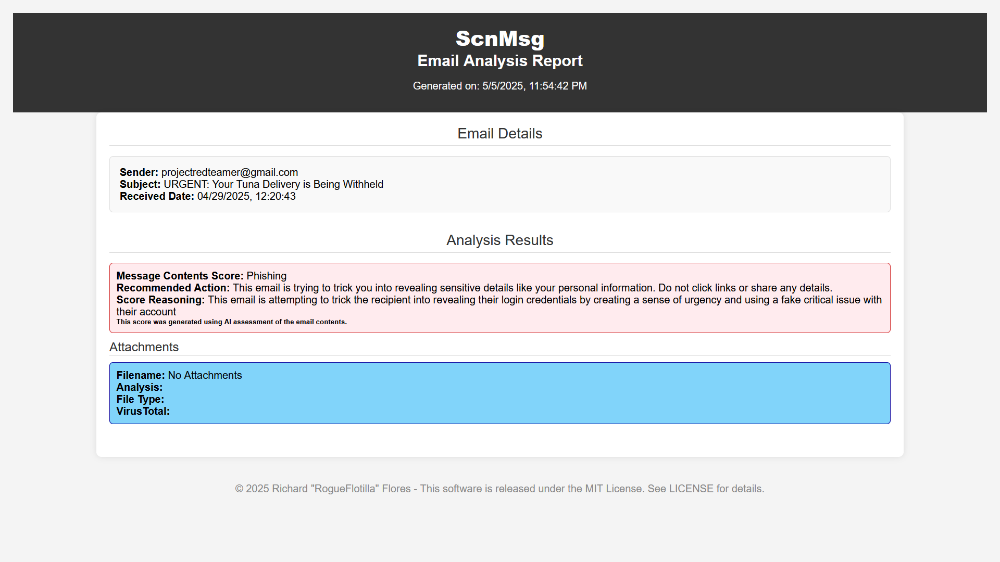

## Future Improvements
The following areas for future improvement of expansion of this software have been identified
### Features Additions
- [ ] Implement sending of emails (SMTP integration)
- [ ] Implement deletion of emails
- [ ] Implement "Mark as SPAM" fature, and integrate scoring into category analysis
- [ ] Header analysis (sender obfuscation, extraction of other data to analyze: domains, IPs, etc.)
- [ ] Link analysis (URL Scan)
- [ ] Short link analysis (short link expansion for transparency)
- [ ] IP analysis (WHOIS, geolocation)

### Quality Enhancements
- [ ] Refinement of AI system prompt to better detect SPAM emails
- [ ] Refinement of AI system prompt to in include additonal categories (personal, work, etc.)
- [ ] Cleanup code (effciency / clarity)
- [ ] Implement robust commenting for complex code
- [ ] Alternative scanners to VirusTotal (in liu of Private API key, faster scanning)