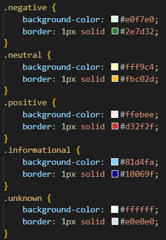
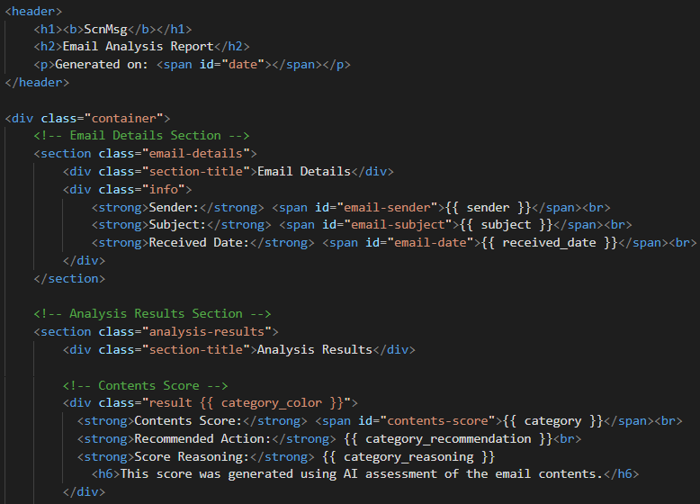
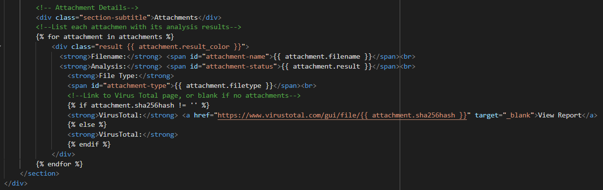

## Introduction
The ScnMsg email client is a simple email client created using Python and some HTML with the goal to detect, reduce, and hopefully prevent malware execution, scams, and phishing attempts on the technology illiterate, cyber-unaware, and especially the elderly population that can be easily manipulated. The goal is to integrate features that will check emails against existing tools, such as Virus Total, and use AI to assess contents to provide a scoring mechanism to alert a user to potential risks through use of Groq API calls. Complex features seen in other email clients such as automatic replies, folder sorting, and advanced filtering rules will intentionally be left out since the target users for this software would likely not be the group to leverage those features and may make its use more complicated for the anticipated user.

## Explanation and Details
Coming soon to a README near you.

The ScnMsg icon was created using ChatGPT, with the prompt:
> Can you make an icon for an application I'm building called ScnMsg?

This proposal is to make a simple email client using Python to detect, reduce, and hopefully prevent malware execution, scams, and phishing attempts on the technology illiterate, cyber-unaware, and especially the elderly population that can be easily manipulated. The goal is to integrate features that will check emails against existing tools and use AI to assess contents to provide a scoring mechanism to alert a user to potential risks.

## Setup and Libraries
The following modules are not standard Python3 libraries and must be installed manually before use:
- bs4 (BeautifulSoup)
- imap_tools
- jinja2
- PyQt5
- requests
- vt (Virus Total)

**Use this command to install these packages before attempting to run the code:** 
`pip install beautifulsoup4 imap-tools Jinja2 PyQt5 requests virustotal-python`

**To run the application GUI, run either of these commands from the root folder (ScnMsg) of the code:** 
Windows:  `python .\Python\email_client.py` 
Linux: `python3 .\Python\email_client.py` 
*Notes:  Command syntax may vary by OS or other settings. MacOS has not been tested for this project.*

### Table of Libraries Used
| Module or Package | Component(s) | Usage |
| ------- | ---------- | -------- |
| [bs4](https://pypi.org/project/beautifulsoup4/) | BeautifulSoup | Used to convert an HTML only email to text due to Groq API token restrictions. |
| [configparser](https://docs.python.org/3/library/configparser.html#module-configparser) | - | Use of Config file for storing email settings |
| [hashlib](https://docs.python.org/3/library/hashlib.html#module-hashlib) | - | Hashing of files for faster VirusTotal lookup |
| [imap_tools](https://pypi.org/project/imap-tools/) | MailBox | Recieve emails from an email provider using IMAP server |
| [io](https://docs.python.org/3/library/io.html#module-io) | BytesIO | Convert attachments to bytes for VirusTotal scanning of files |
| [jinja2](https://pypi.org/project/Jinja2/) | - | Template engine that builds HTML report files with passed variables |
| [json](https://docs.python.org/3/library/json.html#module-json) | - | Read returned Gorq data as JSON format |
| [operator](https://docs.python.org/3/library/operator.html#module-operator) | itemgetter | Sort emails from newest to oldest, or vice versa |
| [os](https://docs.python.org/3/library/os.html#module-os) | - | USE CASE |
| [pickle](https://docs.python.org/3/library/pickle.html#module-pickle) | - | Save each email in its own pickle file to avoid filling RAM |
| [PyQt5](https://pypi.org/project/PyQt5/) | QtGui QtWidgets | Email Client GUI |
| [requests](https://pypi.org/project/requests/) | - | Integration with Groq API via URL POST request |
| [sys](https://docs.python.org/3/library/sys.html#module-sys) | - | Start and Exit the Application GUI |
| [time](https://docs.python.org/3/library/time.html#module-time) | - | Pause between VirusTotal API calls when using Public API key |
| [vt](https://github.com/doomedraven/VirusTotalApi) | - | Integration with VirusTotal API |
| [webbrowser](https://docs.python.org/3/library/webbrowser.html#module-webbrowser) | - | Open the email reports in a webbrowser |

## Screenshots and Code Explanation
This section displays tables containing screenshots of key secitons of code code with descriptions of the functionality being performed for each package (file) of the program.

### HTML Report Template (./HTML/report.html)
| Code Image *(click to enlarge)* | Description |
|-------------------------------|-------------|
| &nbsp;&nbsp;&nbsp;&nbsp;&nbsp;&nbsp;&nbsp;&nbsp;&nbsp;&nbsp;&nbsp;&nbsp;&nbsp;&nbsp;&nbsp;&nbsp;&nbsp;&nbsp;&nbsp;&nbsp; | Some of the class attributes are formatting blocks that define coloring for severity levels: `.negative` (no flagged alerts), `.neutral` (potentially noteworthy but not malicious), `.positive` (likely malicious), `.informational` (general awareness), and `.unknown` (ex. couldn't be processed due to error or failure). The severity levels are passed to placeholders as variables when creating the report allowing the blocks colors to be defined based on the analysis results.     the class attribures are applied dynamically within the code to allow different coloring based on the results of the analysis, such as a file returned by Virus Total as likely being malware showing as red, or a potential spam email showing as yellow (not likely malicious, but might want to be ignored). |
| &nbsp;&nbsp;&nbsp;&nbsp;&nbsp;&nbsp;&nbsp;&nbsp;&nbsp;&nbsp;&nbsp;&nbsp;&nbsp;&nbsp;&nbsp;&nbsp;&nbsp;&nbsp;&nbsp;&nbsp; | This section of the HTML report template defines the structure for the top of the email analysis report. It displays the header of the report, email details such as sender, subject, and the received date, and the AI-generated analysis for the email body contents. Template placeholders can be seen here where the Jinja2 engine is creating the report by filling in variable placeholders such as {{ sender }} or {{ category_reasoning }} |
| &nbsp;&nbsp;&nbsp;&nbsp;&nbsp;&nbsp;&nbsp;&nbsp;&nbsp;&nbsp;&nbsp;&nbsp;&nbsp;&nbsp;&nbsp;&nbsp;&nbsp;&nbsp;&nbsp;&nbsp; | A '{ % for % } statement is used to generate separate sections for each file attachment in the email. For example, an email with one attachment will have only one block, while an email with six attachments will have six blocks, each with their cooresponding information from the analysis by Virus Total. An '{ % if % }' statement is used to dynamically generate a link to the associated Virus Total page for the file that was analyzed, or if there are no attachments an information block is created using anto let the report reader know nothing was attached. |
| &nbsp;&nbsp;&nbsp;&nbsp;&nbsp;&nbsp;&nbsp;&nbsp;&nbsp;&nbsp;&nbsp;&nbsp;&nbsp;&nbsp;&nbsp;&nbsp;&nbsp;&nbsp;&nbsp;&nbsp; | The footer of the report contains copyright and license details. There is also a script that contains code generating a date for the time the report was created to be used in the header. Both of these detail not only create a professional looking report, but provide important information to the reader. |

## Future Improvements
The following areas for future improvement of expansion of this software have been identified
- [ ] Implement sending of emails
- [ ] Cleanup code (effciency / clarity)
- [ ] Implement robust commenting for complex code